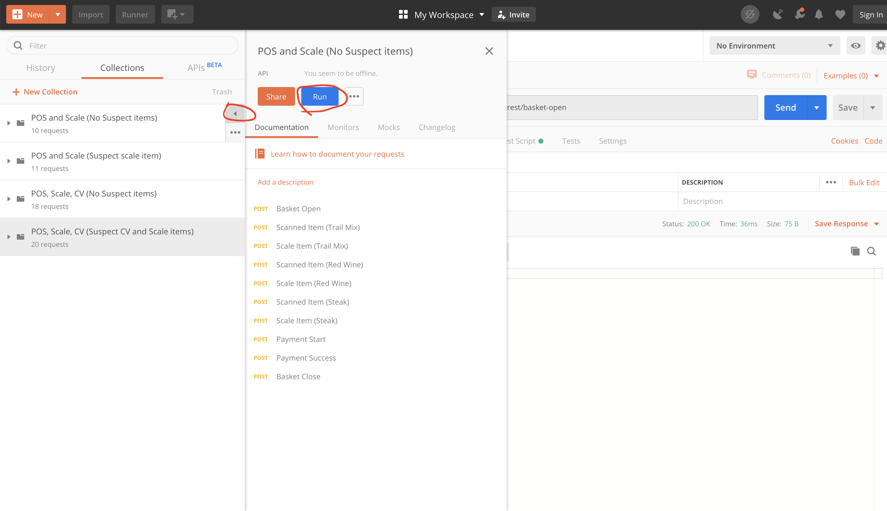

# Phase 1 - Simulate Events

## Overview

Phase 1 is a all about event simulation, we will learn how to send events to device-rest to simulate a sensor fusion loss-detection system.  We will send [POS Events](../rtsf_at_checkout_events/checkout_events.md#pos-events), [Scale Events](../rtsf_at_checkout_events/checkout_events.md#scale-events), [CV ROI Events](../rtsf_at_checkout_events/checkout_events.md#cv-roi-events), and [RFID ROI Events](../rtsf_at_checkout_events/checkout_events.md#rfid-roi-events) as HTTP Post requests through the [Event Simulator](../rtsf_at_checkout_events/event_simulation.md) and the popular API testing application [Postman](https://www.getpostman.com/downloads/).

The concepts you will learn about sending HTTP events to device-rest also apply when sending MQTT events to device-mqtt, [MQTT.fx](https://mqttfx.jensd.de/) is a useful tool for composing MQTT events for testing and simulation purposes.

## Getting Started

- Install [Postman](https://www.getpostman.com/downloads/)
- Complete steps 1-4 from the [Getting Started](rtsf-at-checkout-reference-design/#step-1-clone-the-repository)
- Ensure all the containers are up and running

With that all setup, we are now ready to start creating simulated scenarios.


## Using Postman

Open Postman and send an HTTP GET request to <http://localhost:49986/api/v1/ping> to ensure the service is online.

!!! success
    After running this you should see a `pong` message returned.

!!! failure
    If you get a Response Status Code 404 or no response make sure you have correctly built and ran device-rest

Now that we know device-rest is working properly we can build a simple scenario.

### Basic Scenario

This scenario is to open the basket, scan one POS item, and close the transaction.

For each operation the expected success and failures are as follows.

!!! note
    When sending checkout event it is useful to follow the docker logs for the 'event-reconciler' in-order to ensure the events are being processed correctly.  To do this run `docker logs -f event-reconciler` in a terminal window, this will follow the logs for the event-reconciler service.

!!! success
    Response Status Code 200 OK.
    event-reconciler docker logs shows the event being processed.

!!! failure
    Response Status Code 404 or no response
    event-reconciler docker logs show an error processing the event or no events occur in the event-reconciler logs

#### Initiate the transaction

`basket-open` send a POST request to <http://localhost:49986/api/v1/resource/device-pos-rest/basket-open> with body:

```json
{
    "lane_id":"1",
    "basket_id": "abc-012345-def",
    "customer_id": "joe5",
    "employee_id": "mary1",
    "event_time":15736013930000
}
```

#### Scan the item

`scanned-item` send a POST request to <http://localhost:49986/api/v1/resource/device-pos-rest/scanned-item> with body:

```json
{
    "lane_id":"1",
    "basket_id": "abc-012345-def",
    "product_id": "00000000571111",
    "product_id_type": "UPC",
    "product_name": "Trail Mix",
    "quantity": 1,
    "quantity_unit": "EA",
    "unit_price": 5.99,
    "customer_id": "joe5",
    "employee_id": "mary1",
    "event_time":15736013940000
}
```

#### Prepare for payment

`payment-start` send a POST request to <http://localhost:49986/api/v1/resource/device-pos-rest/payment-start> with body:

```json
{
    "lane_id":"1",
    "basket_id": "abc-012345-def",
    "customer_id": "joe5",
    "employee_id": "mary1",
    "event_time":15736013950000
}
```

#### Payment has succeeded

`payment-success` send a POST request to <http://localhost:49986/api/v1/resource/device-pos-rest/payment-success> with body:

``` json
{
    "lane_id":"1",
    "basket_id": "abc-012345-def",
    "customer_id": "joe5",
    "employee_id": "mary1",
    "event_time":15736013960000
}
```

#### Transaction has closed

`basket-close` send a POST request to <http://localhost:49986/api/v1/resource/device-pos-rest/basket-close> with body:

``` json
{
    "lane_id":"1",
    "basket_id": "abc-012345-def",
    "customer_id": "joe5",
    "employee_id": "mary1",
    "event_time":15736013970000
}
```

You have successfully created a simulated scenario with one sensor, the POS.  Next, we will explore making more complicated scenarios using Postman Collections.

### Using Postman Collections

Instead of manually making the HTTP calls for each event, we have created several full scenarios as Postman Collections.  These collections test different sensor combinations and various product and customer behaviors.  The included Postman Collections can be used and built upon to:

- Understanding the reference solution
- Generate simulated data to test or improve the reconciliation algorithm
- To simulate one or more device(s), so that your own device can run along side the other simulated devices
- General testing and validation

To use the Postman Collections, open Postman and click the 'Import' button, Click 'Choose Files' and select the [included collections](https://github.com/intel-iot-devkit/rtsf-at-checkout-reference-design/blob/master/loss-detection-app/postman-collections).

Once imported, mouse over the collection you want to run and click the play button. Next, click the run button to open the Collection Runner, and click the 'Run ...' button to being the simulated transaction.





!!! success
    In the event-reconciler logs, the result of running a non-suspect collection will be `No suspect items detected`, and the result of running a collection that contains suspect items will be a json message containing the suspect lists.

``` json
{
   "cv_suspect_list": [...],
   "rfid_suspect_list": [...],
   "scale_suspect_list": { ... }
}
```

## Using Event Simulator

As an alternative to Postman collections for automating transaction baskets, the [Event Simulator](../rtsf_at_checkout_events/event_simulation.md) can be used to test and explore the example reference design until you feel comfortable with it. 

Be sure to have the event-reconciler logs open in a terminal window while running the simulator like you did when running the Postman Collections.

## End Results

You have successfully created a simulated reference design containing multiple sensors. At this point, you and are ready to integrate your own components to create your own Real Time Sensor Fusion for Loss Detection at Checkout solution.
